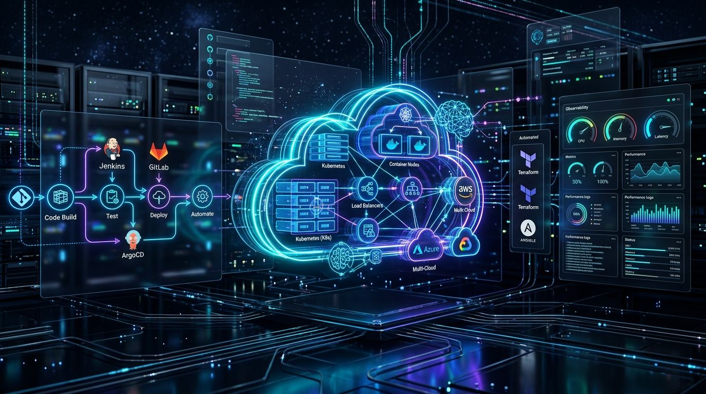

<p align="center">
  
</p>

<h1 align="center">🚀 Cloud & DevOps Engineering Roadmap</h1>

<p align="center">
  <strong>An Enterprise-Grade, Zero-to-Production Mastery Curriculum for Cloud Architects, DevOps, SREs, and Platform Engineers.</strong>
</p>

<p align="center">
  <a href="https://github.com/bvthz5/cloud-devops-engineering-roadmap"></a>
  <a href="https://github.com/bvthz5/cloud-devops-engineering-roadmap"></a>
  <a href="https://github.com/bvthz5/cloud-devops-engineering-roadmap"></a>
  <a href="https://github.com/bvthz5/cloud-devops-engineering-roadmap"></a>
  <a href="LICENSE"></a>
  <a href="https://github.com/bvthz5/cloud-devops-engineering-roadmap/pulls"></a>
</p>

---

## 📖 Welcome & Overview

Welcome to the **Cloud & DevOps Engineering Roadmap** — a battle-tested, structured curriculum covering everything from low-level Linux systems and TCP/IP networking to hyperscale multi-cloud architectures, Kubernetes operators, automated GitOps delivery, enterprise observability, DevSecOps, SRE error budgets, and next-generation AIOps & LLMOps.

Whether you are preparing for senior engineering interviews, architecting cloud-native platforms, or automating day-2 operations, this repository provides **in-depth theory, production-grade configuration files, incident post-mortems, and rapid revision cheat sheets**.

> ⚡ **Quick-Revision Short Notes (Kids-Mind Style):** In a rush or preparing for interviews? Check out our dedicated [📓 DevOps & Cloud Short Notes Hub](my-notes/00-Index.md) featuring 14 easy-to-understand, 1-line definition study guides covering Linux, Windows, Networking, Docker, K8s, AWS & Azure types, Web Servers, Observability, DevSecOps, and SRE/GitOps!

---

## 🎯 What’s in the Notes? (The Standard Module Architecture)

Every single module in this repository is built around a rigorous **learning and execution cycle**, giving you immediate practical competence:

```text
┌─────────────────┐       ┌─────────────────┐       ┌─────────────────┐
│  01 - 03        │ ───►  │  04 - 06        │ ───►  │  07             │
│  Deep Dive &    │       │  Configuration, │       │  Real-World     │
│  Mechanics      │       │  Commands & Code│       │  Scenarios      │
└─────────────────┘       └─────────────────┘       └─────────────────┘
         │                                                   │
         ▼                                                   ▼
┌─────────────────┐       ┌─────────────────┐       ┌─────────────────┐
│  12             │ ◄───  │  09 & 11        │ ◄───  │  08             │
│  Quick Revision │       │  Interview Q&A  │       │  Troubleshooting│
│  Cheat Sheet    │       │  & MCQ Quizzes  │       │  & Debugging    │
└─────────────────┘       └─────────────────┘       └─────────────────┘
```

| File / Component | What You Will Learn & Practice |
|:---|:---|
| **01 – 03 Core & Deep Dive** | First-principles theory, kernel mechanics, distributed system protocols, flow charts, and architectural diagrams. |
| **04 – 06 Configuration & Commands** | Tested CLI commands, production manifests (`YAML`, `HCL`, `Python`, `Bash`), pipelines, and best practices. |
| **07 Real-World Scenarios** | High-traffic architectural patterns, zero-downtime migrations, multi-tenant isolation, and incident case studies. |
| **08 Troubleshooting & Root Cause Analysis** | Failure modes, triage runbooks, diagnostic toolchains, logs analysis, and step-by-step resolution workflows. |
| **09 Interview Q&A** | Real-world scenario-based interview questions asked by Tier-1 enterprise and hyperscaler engineering teams. |
| **10 Hands-On Practice** | Step-by-step terminal labs and infrastructure challenges with reproducible sandbox instructions. |
| **11 Multiple Choice Quizzes (MCQ)** | Conceptual checkpoints with detailed answer explanations to cement foundational knowledge. |
| **12 Quick Revision Cheat Sheet** | High-yield 5-minute pre-interview summary, command index, key architectural rules, and mental models. |

---

## 🗺️ Complete 24-Stage Learning Roadmap

Click on any stage below to jump straight to its modules, deep-dive lessons, and terminal labs:

| # | Domain Stage | Direct Path | Modules | Core Technologies & Highlights |
|:---:|:---|:---:|:---:|:---|
| **01** | **Computer Hardware & Architecture** | [Explore `01 - Basics`](roadmap/01%20-%20Basics/) | **8** | CPU microarchitecture, x86/ARM, Memory caching, Virtual memory, Storage subsystems |
| **02** | **Linux & Systems Engineering** | [Explore `02 - Linux`](roadmap/02%20-%20Linux/) | **33** | FHS, Kernel internals, systemd, Storage/LVM, eBPF, Package managers, Let's Encrypt |
| **03** | **Computer Networking & Protocols** | [Explore `03 - Networking`](roadmap/03%20-%20Networking/) | **14** | OSI 7-layer, Subnetting/CIDR, DNS, HTTP/3 & QUIC, BGP Routing, Overlay CNI, Firewalls |
| **04** | **Git & Version Control** | [Explore `04 - Git & Version Control`](roadmap/04%20-%20Git%20&%20Version%20Control/) | **11** | Git internals & plumbing, Trunk-based vs GitFlow, Hooks, Conflict triage, Monorepos |
| **05** | **Programming & Scripting for Ops** | [Explore `05 - Programming & Scripting`](roadmap/05%20-%20Programming%20&%20Scripting/) | **9** | Production Bash automation, Python for DevOps, Golang cloud services, REST & gRPC APIs |
| **06** | **Web Servers & Reverse Proxies** | [Explore `06 - Web Servers & Reverse Proxies`](roadmap/06%20-%20Web%20Servers%20&%20Reverse%20Proxies/) | **10** | Nginx event-driven model, Apache HTTPD, TLS 1.3 termination, Caching, Rate limiting |
| **07** | **Containers & Docker** | [Explore `07 - Containers & Docker`](roadmap/07%20-%20Containers%20&%20Docker/) | **11** | Linux namespaces & cgroups, Multi-stage builds, Container security, Docker Compose |
| **08** | **Kubernetes & Cloud-Native Orchestration** | [Explore `08 - Kubernetes & Orchestration`](roadmap/08%20-%20Kubernetes%20&%20Orchestration/) | **19** | Control plane internals, Pod scheduling, Services & CNI, Helm, CRDs, Custom Operators |
| **09** | **Infrastructure as Code (Terraform & OpenTofu)** | [Explore `09 - Infrastructure as Code`](roadmap/09%20-%20Infrastructure%20as%20Code%20(Terraform%20&%20OpenTofu)/) | **16** | HCL syntax, State locking & remote backends, Terragrunt, Atlantis CI, Drift detection |
| **10** | **Configuration Management (Ansible)** | [Explore `10 - Configuration Management`](roadmap/10%20-%20Configuration%20Management%20(Ansible)/) | **14** | Agentless push architecture, Playbooks, Jinja2 templating, Roles, Ansible Vault, AWX |
| **11** | **Cloud Computing: Amazon Web Services (AWS)** | [Explore `11 - Cloud Computing - AWS`](roadmap/11%20-%20Cloud%20Computing%20-%20AWS/) | **14** | IAM policies, Multi-tier VPC, EC2 & ASG, S3 classes, RDS & DynamoDB, EKS, Lambda, Cost optimization |
| **12** | **Cloud Computing: Microsoft Azure** | [Explore `12 - Cloud Computing - Azure`](roadmap/12%20-%20Cloud%20Computing%20-%20Azure/) | **14** | Microsoft Entra ID, VNets & NSGs, AKS, App Services, Azure DevOps, Bicep & ARM, Azure Arc |
| **13** | **Cloud Computing: Google Cloud Platform (GCP)** | [Explore `13 - Cloud Computing - Google Cloud`](roadmap/13%20-%20Cloud%20Computing%20-%20Google%20Cloud%20(GCP)/) | **14** | GCP Hierarchy, Cloud IAM, VPC & Cloud Router, GCE MIGs, GKE Autopilot, Cloud Run, Cloud Build |
| **14** | **Multi-Cloud Architecture & FinOps** | [Explore `14 - Multi-Cloud & FinOps`](roadmap/14%20-%20Multi-Cloud%20&%20FinOps/) | **12** | Multi-cloud strategy, FinOps cost allocation, Kubecost, Infracost in CI/CD, Spot orchestration |
| **15** | **CI/CD Pipelines & Continuous Delivery** | [Explore `15 - CI-CD Pipelines & Automation`](roadmap/15%20-%20CI-CD%20Pipelines%20&%20Automation/) | **12** | GitHub Actions, Jenkins declarative pipelines, GitLab CI, Nexus/Artifactory, Canary rollouts |
| **16** | **GitOps & Progressive Delivery** | [Explore `16 - GitOps & Progressive Delivery`](roadmap/16%20-%20GitOps%20&%20Progressive%20Delivery/) | **10** | ArgoCD applications & App-of-Apps, FluxCD toolkit, Argo Rollouts, Flagger, Automated secrets |
| **17** | **Monitoring, Logging & Observability** | [Explore `17 - Monitoring, Logging & Observability`](roadmap/17%20-%20Monitoring,%20Logging%20&%20Observability/) | **12** | Prometheus metrics & PromQL, Grafana, Alertmanager, Loki & ELK, OpenTelemetry, eBPF profiling |
| **18** | **DevSecOps & Security Engineering** | [Explore `18 - DevSecOps & Security Engineering`](roadmap/18%20-%20DevSecOps%20&%20Security%20Engineering/) | **12** | Shift-Left, HashiCorp Vault, SonarQube, Trivy container scanning, Cosign, OPA & Kyverno |
| **19** | **Service Mesh & Microservices** | [Explore `19 - Service Mesh & Microservices`](roadmap/19%20-%20Service%20Mesh%20&%20Microservices/) | **10** | Istio VirtualServices, Linkerd, Strict mTLS, Envoy Gateway, Istio Ambient sidecarless mesh |
| **20** | **Site Reliability Engineering (SRE)** | [Explore `20 - SRE & Reliability Engineering`](roadmap/20%20-%20SRE%20&%20Reliability%20Engineering/) | **10** | SLI/SLO/SLA definitions, Error budget burn rates, Incident command, Blameless post-mortems, Chaos Mesh |
| **21** | **Database Reliability Engineering (DBRE)** | [Explore `21 - Database Reliability Engineering`](roadmap/21%20-%20Database%20Reliability%20Engineering%20(DBRE)/) | **10** | PostgreSQL/MySQL internals, WAL replication, PITR disaster recovery, Flyway, K8s DB operators |
| **22** | **AI for DevOps, AIOps & LLMOps** | [Explore `22 - AI for DevOps, AIOps & LLMOps`](roadmap/22%20-%20AI%20for%20DevOps,%20AIOps%20&%20LLMOps/) | **12** | AI code generation, K8sGPT triage, vLLM / Ollama deployment, NVIDIA GPU operator, Langfuse, Guardrails |
| **23** | **Real-World Projects & Enterprise Architectures** | [Explore `23 - Real-World Projects`](roadmap/23%20-%20Real-World%20Projects%20&%20Enterprise%20Architectures/) | **12** | End-to-end production systems: 3-tier AWS, DevSecOps pipeline, GitOps K8s, Self-healing cluster, vLLM |
| **24** | **Scenario-Based Interview Questions & Answers** | [Explore `24 - Interview Scenarios`](roadmap/24%20-%20Scenario-Based%20Interview%20Questions%20%26%20Answers/) | **20** | 200 Production incidents & triage drills, architecture failure recoveries, candidate verbal pitches, and rapid-fire CLI cheat sheets |

---

## ⚡ Recommended Learning Tracks

Depending on your career goals, follow one of these tailored tracks:

```text
Track A: Foundation & Systems   ──► Stages 01, 02, 03, 04, 05, 06
Track B: Cloud & Container Ops  ──► Stages 07, 08, 09, 10, 11 (or 12/13)
Track C: Delivery & Security    ──► Stages 15, 16, 18, 19
Track D: Reliability & SRE      ──► Stages 14, 17, 20, 21
Track E: AI & Advanced Platform ──► Stages 22, 23 (Production Architectures)
Track F: Interview & Incident Mastery ──► Stage 24 (200 Production Scenarios & Verbal Pitches)
```

1. **🐣 Associate Cloud/DevOps Engineer (Weeks 1 – 8)**:
   - Complete **Stages 01 to 07**: Master the Linux command line, networking foundations, Git workflows, Python scripting, and Docker containerization.
2. **🚀 Cloud Infrastructure & Platform Engineer (Weeks 9 – 16)**:
   - Complete **Stages 08 to 14**: Master Kubernetes administration, Terraform & OpenTofu, Ansible configuration, AWS/Azure/GCP architectures, and FinOps cost optimization.
3. **🛡️ DevSecOps & Enterprise Automation Specialist (Weeks 17 – 20)**:
   - Complete **Stages 15, 16, 18, 19**: Implement end-to-end CI/CD with GitHub Actions & Jenkins, declarative GitOps with ArgoCD, container image signing with Cosign, and service mesh routing with Istio.
4. **🧠 Senior SRE & Next-Gen AI Platform Engineer (Weeks 21 – 24+)**:
   - Complete **Stages 17, 20, 21, 22, 23**: Design SLO/SLI dashboards, manage multi-region database failovers, run chaos experiments, deploy local LLM inferencing clusters with vLLM & GPUs, and build production reference architectures.
5. **🎯 Staff / Principal / Lead Interview Prep**:
   - Complete **Stage 24**: Master all 200 real-world production incident response scenarios, root-cause analysis explanations, exact CLI diagnostic toolchains, and articulate verbal pitch answers across all 20 core domains.

---

## 🧭 Seamless Navigation Flow

Every single guide in this repository contains a synchronized navigation header and footer:

- **Next Lesson / Previous Lesson**: Walk linearly through all concepts without jumping between browser tabs.
- **Cross-Folder & Cross-Stage Chaining**: Reaching the end of a module automatically guides you to the next topic in the curriculum.
- **Root Link**: One-click return back to this root [README.md](README.md) at any point.

```markdown
| Previous | Index | Next |
| :--- | :---: | ---: |
| [← 01 - Core Concepts](./01-Core-Concepts.md) | [Index](../../../README.md) | [03 - Deep Dive →](./03-Deep-Dive.md) |
```

---

## 📓 Kids-Mind Short Notes & Rapid Study Hub

Supercharge your revision with our high-yield, 1-line plain language cheat sheets with real-world analogies, command breakdowns, and screen outputs:
- 🐧 **[`01 - Linux Commands, Links & Inodes`](my-notes/01-Linux-Commands-Easy-Guide.md)**: Files, soft/hard links (`ln`, `ln -s`), permissions, systemctl, tar.
- 🪟 **[`02 - Windows CMD & PowerShell`](my-notes/02-Windows-PowerShell-CMD-Easy-Guide.md)**: `ipconfig /all`, DNS flushing, taskkill, and PowerShell cmdlets.
- 🌐 **[`03 - Networking, OSI Model & Port Numbers`](my-notes/03-Networking-Commands-and-Concepts-Easy-Guide.md)**: OSI 7 Layers, TCP handshake, CIDR, `ip addr`, and 40+ master ports.
- 🐳 **[`04 - Docker & Containers`](my-notes/04-Docker-and-Containers-Short-Notes.md)**: Images, containers, build, run, prune, port mapping, Dockerfile, Compose.
- ☸️ **[`05 - Kubernetes (K8s)`](my-notes/05-Kubernetes-K8s-Short-Notes.md)**: Pods, Deployments, Services, Ingress, RBAC, Helm, and `kubectl` screen outputs.
- ☁️ **[`06 - Cloud Computing (AWS, Azure, GCP)`](my-notes/06-Cloud-Computing-AWS-Azure-GCP-Short-Notes.md)**: Compute, S3/Storage, VPC, Subnets, NAT, IAM, and FinOps.
- 🔀 **[`07 - Git & CI/CD Pipelines`](my-notes/07-Git-and-CICD-Short-Notes.md)**: 4 Git areas, branching, merge/rebase, stash, and GitHub Actions workflows.
- 🏗️ **[`08 - Terraform & Ansible (IaC)`](my-notes/08-Terraform-and-Ansible-IaC-Short-Notes.md)**: HCL, State, Plan/Apply, Ansible Playbooks, Roles, and Vault.
- 📑 **[`Explore Master Notes Index`](my-notes/00-Index.md)**: Full table of contents and study tracker.

---

## 🛠️ How to Get Started

```bash
# 1. Clone the repository
git clone https://github.com/bvthz5/cloud-devops-engineering-roadmap.git

# 2. Enter directory
cd cloud-devops-engineering-roadmap

# 3. Open in your favorite editor (VS Code, Cursor, Antigravity)
code .

# 4. Start your journey at Stage 01
# Open: roadmap/01 - Basics/01-Computer-Hardware-and-Architecture/01-Computer-Architecture-and-CPU-Fundamentals.md
```

---

<p align="center">
  <sub>Built with ❤️ for Cloud Engineers, Site Reliability Engineers, and DevOps Practitioners Worldwide.</sub><br />
  <sub>⭐ If this roadmap accelerates your engineering journey, feel free to give it a star on GitHub!</sub>
</p>
