# 06 - Linux Folder Structure (Filesystem Hierarchy Standard - FHS)

Welcome to the comprehensive study module on the **Linux Folder Structure & Filesystem Hierarchy Standard (FHS)**.

---

## 📌 Overview

In Linux, "Everything is a file". Unlike Windows, which uses drive letters like `C:\` and `D:\`, Linux organizes all files, directories, physical storage devices, virtual interfaces, and system parameters into a single inverted tree hierarchy starting at the **Root Directory (`/`)**.

This topic breaks down the entire filesystem layout according to the **Filesystem Hierarchy Standard (FHS)**, detailing mandatory directories, modern distro conventions (like *usr-merge*), virtual pseudo-filesystems (`/proc`, `/sys`, `/dev`), mount points, real-world DevOps scenarios, troubleshooting, interview prep, and hands-on exercises.

---

## 🗺️ Visual Architecture Diagram

```mermaid
graph TD
    Root["/ (Root Directory)"]
    
    Root --> Boot["/boot (Kernel, Initrd, GRUB)"]
    Root --> Usr["/usr (User Binaries & Libraries)"]
    Root --> Etc["/etc (System Configuration)"]
    Root --> Var["/var (Variable Data: Logs, Spools, Databases)"]
    Root --> Home["/home (User Home Directories)"]
    Root --> RootUser["/root (Root User Home Directory)"]
    Root --> Opt["/opt (Optional / 3rd Party Software)"]
    Root --> Srv["/srv (Service Data: Web, FTP)"]
    Root --> Tmp["/tmp (Temporary Files - cleared on boot/tmpfs)"]
    Root --> Run["/run (Runtime Data - tmpfs, PID files, Sockets)"]
    Root --> Proc["/proc (Virtual: Process & Kernel Information)"]
    Root --> Sys["/sys (Virtual: Hardware & Driver Information)"]
    Root --> Dev["/dev (Virtual: Device Files - block/char)"]
    Root --> Mnt["/mnt (Temporary Mount Points)"]
    Root --> Media["/media (Removable Media Mount Points)"]
    
    %% Usr-merge symlinks
    Usr --> Bin["/usr/bin"]
    Usr --> Sbin["/usr/sbin"]
    Usr --> Lib["/usr/lib"]
    
    Root -.-> SymBin["/bin ➔ /usr/bin"]
    Root -.-> SymSbin["/sbin ➔ /usr/sbin"]
    Root -.-> SymLib["/lib ➔ /usr/lib"]
```

---

## 📚 Module Breakdown

| # | File / Module | Key Focus Areas |
| :---: | :--- | :--- |
| **01** | [`01-Filesystem-Root.md`](file:///c:/Users/binil/OneDrive/Desktop/cloud-devops-engineering-roadmap/Study_Notes_System/akumen%27s/Linux/06-Linux-Folder-Structure/01-Filesystem-Root.md) | The `/` directory, tree root hierarchy, mounting paradigm |
| **02** | [`02-boot.md`](file:///c:/Users/binil/OneDrive/Desktop/cloud-devops-engineering-roadmap/Study_Notes_System/akumen%27s/Linux/06-Linux-Folder-Structure/02-boot.md) | `/boot` contents: vmlinuz, initramfs, GRUB config |
| **03** | [`03-usr.md`](file:///c:/Users/binil/OneDrive/Desktop/cloud-devops-engineering-roadmap/Study_Notes_System/akumen%27s/Linux/06-Linux-Folder-Structure/03-usr.md) | `/usr` secondary hierarchy: `/usr/bin`, `/usr/local`, `/usr/share` |
| **04** | [`04-etc.md`](file:///c:/Users/binil/OneDrive/Desktop/cloud-devops-engineering-roadmap/Study_Notes_System/akumen%27s/Linux/06-Linux-Folder-Structure/04-etc.md) | `/etc` system configuration, `/etc/fstab`, `/etc/systemd/` |
| **05** | [`05-var.md`](file:///c:/Users/binil/OneDrive/Desktop/cloud-devops-engineering-roadmap/Study_Notes_System/akumen%27s/Linux/06-Linux-Folder-Structure/05-var.md) | `/var` state data: `/var/log`, `/var/lib`, `/var/spool`, `/var/www` |
| **06** | [`06-home-and-root.md`](file:///c:/Users/binil/OneDrive/Desktop/cloud-devops-engineering-roadmap/Study_Notes_System/akumen%27s/Linux/06-Linux-Folder-Structure/06-home-and-root.md) | Distinguishing `/` vs `/root` vs `/home/username` |
| **07** | [`07-opt-and-srv.md`](file:///c:/Users/binil/OneDrive/Desktop/cloud-devops-engineering-roadmap/Study_Notes_System/akumen%27s/Linux/06-Linux-Folder-Structure/07-opt-and-srv.md) | `/opt` (3rd party apps) vs `/srv` (service data) |
| **08** | [`08-tmp-and-run.md`](file:///c:/Users/binil/OneDrive/Desktop/cloud-devops-engineering-roadmap/Study_Notes_System/akumen%27s/Linux/06-Linux-Folder-Structure/08-tmp-and-run.md) | Volatile storage: `/tmp` vs `/run` (`tmpfs`, lock/PID files) |
| **09** | [`09-proc-sys-and-dev.md`](file:///c:/Users/binil/OneDrive/Desktop/cloud-devops-engineering-roadmap/Study_Notes_System/akumen%27s/Linux/06-Linux-Folder-Structure/09-proc-sys-and-dev.md) | Pseudo-filesystems: procfs (`/proc`), sysfs (`/sys`), devtmpfs (`/dev`) |
| **10** | [`10-mnt-media-and-data.md`](file:///c:/Users/binil/OneDrive/Desktop/cloud-devops-engineering-roadmap/Study_Notes_System/akumen%27s/Linux/06-Linux-Folder-Structure/10-mnt-media-and-data.md) | Mount locations (`/mnt`, `/media`) and custom directories (`/data`) |
| **11** | [`11-Symbolic-Links-bin-sbin-lib.md`](file:///c:/Users/binil/OneDrive/Desktop/cloud-devops-engineering-roadmap/Study_Notes_System/akumen%27s/Linux/06-Linux-Folder-Structure/11-Symbolic-Links-bin-sbin-lib.md) | Usr-merge migration: `/bin` -> `/usr/bin`, `/sbin`, `/lib` symlinks |
| **12** | [`12-FHS-Mental-Model.md`](file:///c:/Users/binil/OneDrive/Desktop/cloud-devops-engineering-roadmap/Study_Notes_System/akumen%27s/Linux/06-Linux-Folder-Structure/12-FHS-Mental-Model.md) | Static vs Variable, Shareable vs Unshareable matrices |
| **13** | [`13-Useful-Commands.md`](file:///c:/Users/binil/OneDrive/Desktop/cloud-devops-engineering-roadmap/Study_Notes_System/akumen%27s/Linux/06-Linux-Folder-Structure/13-Useful-Commands.md) | Exploring structure: `tree`, `df`, `du`, `lsblk`, `fdisk`, `findmnt` |
| **14** | [`14-Real-World-Scenarios.md`](file:///c:/Users/binil/OneDrive/Desktop/cloud-devops-engineering-roadmap/Study_Notes_System/akumen%27s/Linux/06-Linux-Folder-Structure/14-Real-World-Scenarios.md) | Production setups, log rotation, separate `/var` or `/tmp` partitions |
| **15** | [`15-Troubleshooting.md`](file:///c:/Users/binil/OneDrive/Desktop/cloud-devops-engineering-roadmap/Study_Notes_System/akumen%27s/Linux/06-Linux-Folder-Structure/15-Troubleshooting.md) | Fixing full root filesystems, broken mounts & orphaned symlinks |
| **16** | [`16-Interview-QA.md`](file:///c:/Users/binil/OneDrive/Desktop/cloud-devops-engineering-roadmap/Study_Notes_System/akumen%27s/Linux/06-Linux-Folder-Structure/16-Interview-QA.md) | Frequently asked DevOps & SysAdmin interview questions |
| **17** | [`17-Hands-On-Practice.md`](file:///c:/Users/binil/OneDrive/Desktop/cloud-devops-engineering-roadmap/Study_Notes_System/akumen%27s/Linux/06-Linux-Folder-Structure/17-Hands-On-Practice.md) | Practical terminal challenges & exercises |
| **18** | [`18-MCQ.md`](file:///c:/Users/binil/OneDrive/Desktop/cloud-devops-engineering-roadmap/Study_Notes_System/akumen%27s/Linux/06-Linux-Folder-Structure/18-MCQ.md) | Self-assessment multiple-choice quiz |
| **19** | [`19-Quick-Revision.md`](file:///c:/Users/binil/OneDrive/Desktop/cloud-devops-engineering-roadmap/Study_Notes_System/akumen%27s/Linux/06-Linux-Folder-Structure/19-Quick-Revision.md) | 5-minute revision cheat sheet |
| **20** | [`20-Related-Topics.md`](file:///c:/Users/binil/OneDrive/Desktop/cloud-devops-engineering-roadmap/Study_Notes_System/akumen%27s/Linux/06-Linux-Folder-Structure/20-Related-Topics.md) | Storage, LVM, filesystems & Linux administration roadmap |
| **SOURCE** | [`SOURCE.md`](file:///c:/Users/binil/OneDrive/Desktop/cloud-devops-engineering-roadmap/Study_Notes_System/akumen%27s/Linux/06-Linux-Folder-Structure/SOURCE.md) | Source attribution & educational expansion notes |

---

## 🎯 Learning Objectives

By completing this module, you will be able to:
1. Navigate the Linux directory tree with confidence and understand the exact purpose of every core folder.
2. Differentiate between `/` (Root directory) and `/root` (Superuser home directory).
3. Understand the role of virtual pseudo-filesystems (`/proc`, `/sys`, `/dev`) generated dynamically by the kernel.
4. Manage storage mounts (`/mnt`, `/media`, custom `/data`) and separate partition strategies for production servers.
5. Explain modern Linux developments like **usr-merge** (`/bin` pointing to `/usr/bin`).
