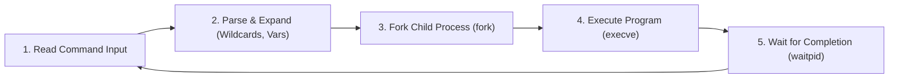

# 07 - The Shell (Command Line Interpreter)

The **Shell** is a user-space application that acts as a command-line interpreter. It accepts text commands from user input or shell scripts, interprets them, and calls the appropriate system utilities or kernel system calls to execute them.

---

## 🐚 Popular Linux Shells

- **`bash` (Bourne Again SHell):** The default standard shell across most Linux distributions.
- **`zsh` (Z Shell):** Advanced interactive shell with rich auto-completion (default in macOS and popular with developers via *Oh My Zsh*).
- **`sh` (Bourne Shell):** POSIX-compliant minimalist legacy shell (often symlinked to `dash` on Ubuntu/Debian).

---

## 🔄 The Shell Execution Loop (REPL)

1. **Read:** Displays prompt (`$`) and waits for keyboard input.
2. **Parse & Expand:** Expands environment variables (`$HOME`), aliases, and globbing wildcards (`*.log`).
3. **Fork (`fork()`):** Creates a child process clone of the shell.
4. **Execute (`execve()`):** Replaces the child process memory space with the target binary executable.
5. **Wait (`waitpid()`):** Shell waits for child process completion and captures its exit status code (`$?`).

---

## ⬅️ Navigation
- Previous: [06 - System Utilities & Binaries](file:///c:/Users/binil/OneDrive/Desktop/cloud-devops-engineering-roadmap/Study_Notes_System/akumen's/Linux/07-Core-Components-of-a-Linux-Machine/06-System-Utilities-and-Binaries.md)
- Next: [08 - User Applications & Services](file:///c:/Users/binil/OneDrive/Desktop/cloud-devops-engineering-roadmap/Study_Notes_System/akumen's/Linux/07-Core-Components-of-a-Linux-Machine/08-User-Applications-and-Services.md)
