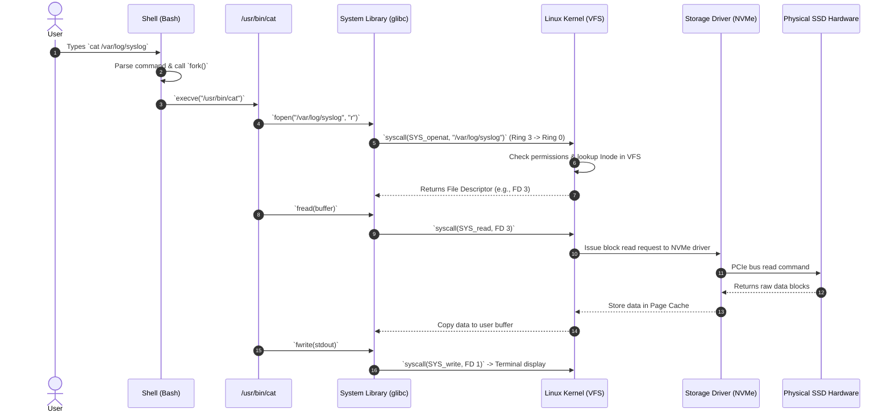

# 09 - End-to-End Command Flow Traversal

To understand how Linux components interact in real time, let's trace the step-by-step traversal of commands across all 6 architectural layers.

---

## 🔍 Case 1: Traversal of `cat /var/log/syslog`

---

## 🔍 Case 2: Traversal of an Incoming Network Packet (`curl` / Web Server)

1. **Hardware Layer:** Electrical/optical pulse hits physical Network Interface Card (NIC).
2. **Device Driver:** NIC triggers hardware interrupt (IRQ). Ethernet driver processes packet into sk_buff data structure.
3. **Kernel Network Stack:** Passes through IP layer -> TCP layer -> Socket buffer.
4. **System Library (`glibc`):** `recv()` / `read()` system call returns data payload to application space.
5. **User Application:** Nginx or Python web application processes application protocol (HTTP/JSON).

---

## ⬅️ Navigation
- Previous: [08 - User Applications & Services](file:///c:/Users/binil/OneDrive/Desktop/cloud-devops-engineering-roadmap/Study_Notes_System/akumen's/Linux/07-Core-Components-of-a-Linux-Machine/08-User-Applications-and-Services.md)
- Next: [10 - Shell Built-ins vs External Binaries (`cd` vs `ls`)](file:///c:/Users/binil/OneDrive/Desktop/cloud-devops-engineering-roadmap/Study_Notes_System/akumen's/Linux/07-Core-Components-of-a-Linux-Machine/10-Shell-Builtins-vs-External-Binaries-cd-vs-ls.md)
