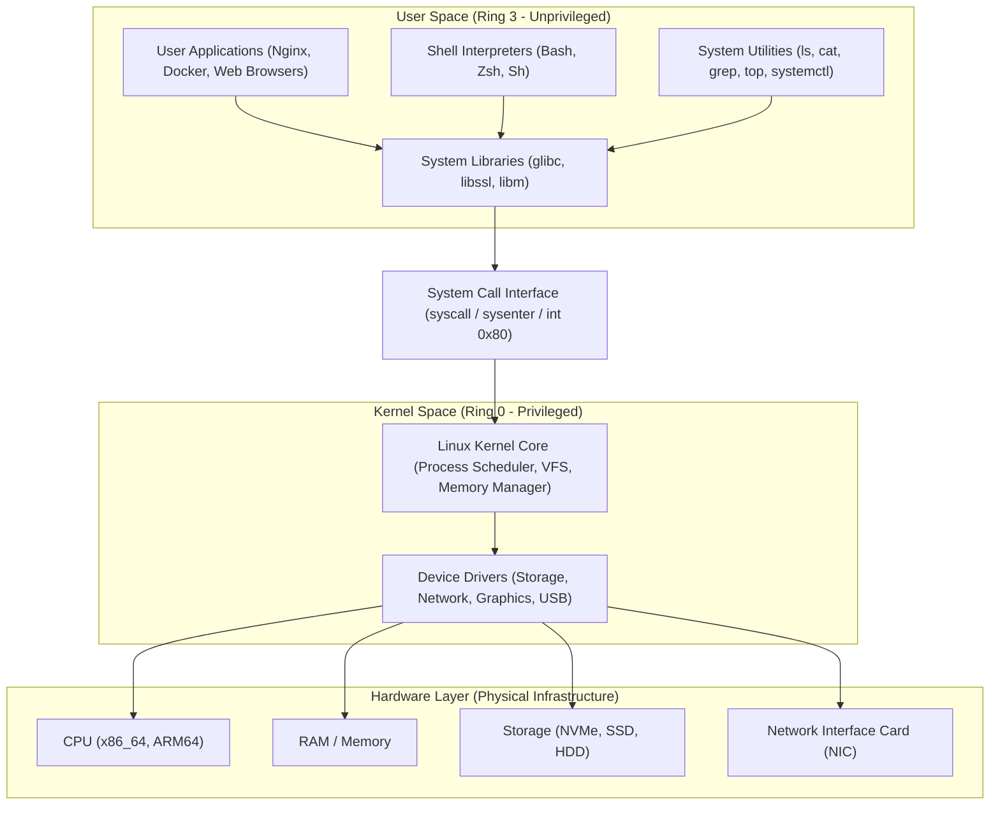

# 07 - Core Components of a Linux Machine

Welcome to the study module on **Core Components of a Linux Machine**.

---

## 📌 Overview

A functional Linux system is built on a modular multi-layered architecture where software abstractions sit between physical hardware and end-user applications. Understanding how these core components interact—from hardware registers and the Linux kernel up through C system libraries (`glibc`), shell interpreters (`bash`), system utilities (`ls`, `cat`), and containerized applications—is fundamental for SysAdmins, DevOps engineers, and SREs.

This module details each architectural layer, command traversal flows (how `cat` or `ls` executes), shell built-ins vs external utilities (`cd` vs `ls`), device drivers, system libraries, real-world troubleshooting, interview preparation, and hands-on exercises.

---

## 🗺️ Complete Layered Architecture Diagram

---

## 📚 Module Breakdown

| # | File / Module | Key Focus Areas |
| :---: | :--- | :--- |
| **01** | [`01-Layered-Architecture-Overview.md`](file:///c:/Users/binil/OneDrive/Desktop/cloud-devops-engineering-roadmap/Study_Notes_System/akumen%27s/Linux/07-Core-Components-of-a-Linux-Machine/01-Layered-Architecture-Overview.md) | High-level architectural overview, User Space vs Kernel Space isolation |
| **02** | [`02-Hardware-Layer.md`](file:///c:/Users/binil/OneDrive/Desktop/cloud-devops-engineering-roadmap/Study_Notes_System/akumen%27s/Linux/07-Core-Components-of-a-Linux-Machine/02-Hardware-Layer.md) | CPU architecture, RAM, storage controllers, NICs, interrupts (IRQs) |
| **03** | [`03-Linux-Kernel-Core.md`](file:///c:/Users/binil/OneDrive/Desktop/cloud-devops-engineering-roadmap/Study_Notes_System/akumen%27s/Linux/07-Core-Components-of-a-Linux-Machine/03-Linux-Kernel-Core.md) | Kernel responsibilities: Process Scheduling, Memory Management, VFS, System Calls |
| **04** | [`04-Device-Drivers.md`](file:///c:/Users/binil/OneDrive/Desktop/cloud-devops-engineering-roadmap/Study_Notes_System/akumen%27s/Linux/07-Core-Components-of-a-Linux-Machine/04-Device-Drivers.md) | Kernel drivers, character/block/net drivers, Loadable Kernel Modules (LKMs) |
| **05** | [`05-System-Libraries-and-Glibc.md`](file:///c:/Users/binil/OneDrive/Desktop/cloud-devops-engineering-roadmap/Study_Notes_System/akumen%27s/Linux/07-Core-Components-of-a-Linux-Machine/05-System-Libraries-and-Glibc.md) | Standard C library (`glibc`), dynamic linking (`ld.so`), static vs dynamic libraries |
| **06** | [`06-System-Utilities-and-Binaries.md`](file:///c:/Users/binil/OneDrive/Desktop/cloud-devops-engineering-roadmap/Study_Notes_System/akumen%27s/Linux/07-Core-Components-of-a-Linux-Machine/06-System-Utilities-and-Binaries.md) | Core utilities (`coreutils`), system management tools, daemon control |
| **07** | [`07-The-Shell.md`](file:///c:/Users/binil/OneDrive/Desktop/cloud-devops-engineering-roadmap/Study_Notes_System/akumen%27s/Linux/07-Core-Components-of-a-Linux-Machine/07-The-Shell.md) | Shell definition, command parsing, environment, stdin/stdout piping |
| **08** | [`08-User-Applications-and-Services.md`](file:///c:/Users/binil/OneDrive/Desktop/cloud-devops-engineering-roadmap/Study_Notes_System/akumen%27s/Linux/07-Core-Components-of-a-Linux-Machine/08-User-Applications-and-Services.md) | User-space applications, background systemd daemons, web servers, containers |
| **09** | [`09-Command-Flow-ls-cat-networking.md`](file:///c:/Users/binil/OneDrive/Desktop/cloud-devops-engineering-roadmap/Study_Notes_System/akumen%27s/Linux/07-Core-Components-of-a-Linux-Machine/09-Command-Flow-ls-cat-networking.md) | End-to-end traversal of `ls`, `cat`, and network packets across layers |
| **10** | [`10-Shell-Builtins-vs-External-Binaries-cd-vs-ls.md`](file:///c:/Users/binil/OneDrive/Desktop/cloud-devops-engineering-roadmap/Study_Notes_System/akumen%27s/Linux/07-Core-Components-of-a-Linux-Machine/10-Shell-Builtins-vs-External-Binaries-cd-vs-ls.md) | Shell Built-ins (`cd`) vs External Executable Binaries (`/bin/ls`) |
| **11** | [`11-Practical-Commands.md`](file:///c:/Users/binil/OneDrive/Desktop/cloud-devops-engineering-roadmap/Study_Notes_System/akumen%27s/Linux/07-Core-Components-of-a-Linux-Machine/11-Practical-Commands.md) | Commands to inspect hardware, kernel modules, libraries, processes (`lscpu`, `lsmod`, `ldd`, `strace`) |
| **12** | [`12-Real-World-Scenarios.md`](file:///c:/Users/binil/OneDrive/Desktop/cloud-devops-engineering-roadmap/Study_Notes_System/akumen%27s/Linux/07-Core-Components-of-a-Linux-Machine/12-Real-World-Scenarios.md) | Production scenarios: driver crashes, glibc version mismatches, kernel panics |
| **13** | [`13-Troubleshooting.md`](file:///c:/Users/binil/OneDrive/Desktop/cloud-devops-engineering-roadmap/Study_Notes_System/akumen%27s/Linux/07-Core-Components-of-a-Linux-Machine/13-Troubleshooting.md) | Step-by-step diagnostic workflow for component-level failures |
| **14** | [`14-Interview-QA.md`](file:///c:/Users/binil/OneDrive/Desktop/cloud-devops-engineering-roadmap/Study_Notes_System/akumen%27s/Linux/07-Core-Components-of-a-Linux-Machine/14-Interview-QA.md) | Technical interview Q&A for Linux system architecture |
| **15** | [`15-Hands-On-Practice.md`](file:///c:/Users/binil/OneDrive/Desktop/cloud-devops-engineering-roadmap/Study_Notes_System/akumen%27s/Linux/07-Core-Components-of-a-Linux-Machine/15-Hands-On-Practice.md) | Practical terminal labs and inspection tasks |
| **16** | [`16-MCQ.md`](file:///c:/Users/binil/OneDrive/Desktop/cloud-devops-engineering-roadmap/Study_Notes_System/akumen%27s/Linux/07-Core-Components-of-a-Linux-Machine/16-MCQ.md) | Self-assessment multiple choice questions |
| **17** | [`17-Quick-Revision.md`](file:///c:/Users/binil/OneDrive/Desktop/cloud-devops-engineering-roadmap/Study_Notes_System/akumen%27s/Linux/07-Core-Components-of-a-Linux-Machine/17-Quick-Revision.md) | High-density 5-minute revision cheat sheet |
| **18** | [`18-Related-Topics.md`](file:///c:/Users/binil/OneDrive/Desktop/cloud-devops-engineering-roadmap/Study_Notes_System/akumen%27s/Linux/07-Core-Components-of-a-Linux-Machine/18-Related-Topics.md) | Next steps in Linux engineering & systems programming |
| **SOURCE** | [`SOURCE.md`](file:///c:/Users/binil/OneDrive/Desktop/cloud-devops-engineering-roadmap/Study_Notes_System/akumen%27s/Linux/07-Core-Components-of-a-Linux-Machine/SOURCE.md) | Source attribution & educational expansion notes |

---

## 🎯 Learning Objectives

By completing this module, you will understand:
1. The 6 core architectural layers of a Linux machine and how they interact.
2. How CPU CPU Hardware Ring Protection (Ring 0 vs Ring 3) enforces security between User Space and Kernel Space.
3. Why `cd` must be a shell built-in while `ls` is an external binary program.
4. How system calls (`open()`, `read()`, `write()`, `execve()`) bridge user programs with kernel device drivers.
5. How dynamic libraries like `glibc` wrap raw kernel system calls into portable C APIs.
