# 08 - Why Choose Linux Over Windows in Cloud & DevOps

Welcome to the study module on **Linux over Windows**.

---

## 📌 Overview

Linux powers over **90% of cloud infrastructure**, 100% of the world's top 500 supercomputers, and the vast majority of Docker container workloads. While Windows dominates desktop computing, Linux is the undisputed standard for server architecture, Cloud computing (AWS, Azure, GCP), and DevOps automation.

This module explores the core reasons why Linux is chosen over Windows for production server environments: cost-effectiveness and open-source licensing, lightweight performance, security architecture, CLI-first philosophy, native containerization support, real-world case studies, troubleshooting, interview prep, and hands-on exercises.

---

## 🗺️ Architectural Comparison Diagram

```mermaid
graph TD
    subgraph WindowsServer["Windows Server Architecture"]
        WinGUI["GUI Layer (Desktop Shell / Heavy RAM footprint)"]
        WinApps["Windows Applications / IIS / PowerShell"]
        WinWin32["Win32 API Subsystem / Registry"]
        WinNT["Windows NT Kernel (Proprietary / Monolithic)"]
        
        WinGUI --> WinApps
        WinApps --> WinWin32
        WinWin32 --> WinNT
    end
    
    subgraph LinuxServer["Linux Server Architecture"]
        HeadlessCLI["Headless CLI / Automation (Minimal RAM footprint)"]
        LinuxApps["Linux Services (Nginx, Docker, K8s, Python)"]
        POSIX["POSIX / Glibc System Calls"]
        LinKernel["Linux Kernel (Open Source / Modular)"]
        
        HeadlessCLI --> LinuxApps
        LinuxApps --> POSIX
        POSIX --> LinKernel
    end
```

---

## 📚 Module Breakdown

| # | File / Module | Key Focus Areas |
| :---: | :--- | :--- |
| **01** | [`01-Why-Linux-Is-Preferred.md`](./01-Why-Linux-Is-Preferred.md) | High-level summary of Linux dominance in Cloud, Servers, and Supercomputers |
| **02** | [`02-Cost-Effectiveness-and-Licensing.md`](./02-Cost-Effectiveness-and-Licensing.md) | Open-source GPL vs Proprietary licensing, CAL costs, cloud TCO reduction |
| **03** | [`03-Performance-Efficiency-and-Resource-Usage.md`](./03-Performance-Efficiency-and-Resource-Usage.md) | Headless servers, lightweight memory footprints, no mandatory GUI overhead |
| **04** | [`04-Security-Permissions-and-Reliability.md`](./04-Security-Permissions-and-Reliability.md) | Unix permission model, low attack surface, uptime stability (no forced reboots) |
| **05** | [`05-Linux-vs-Windows-Comparison-Matrix.md`](./05-Linux-vs-Windows-Comparison-Matrix.md) | Feature-by-feature comparison table (Kernel, Filesystem, Package Management) |
| **06** | [`06-Linux-in-DevOps-Cloud-and-Containers.md`](./06-Linux-in-DevOps-Cloud-and-Containers.md) | Native Docker containers, cgroups, namespaces, Kubernetes, cloud images |
| **07** | [`07-CLI-vs-GUI-Philosophies.md`](./07-CLI-vs-GUI-Philosophies.md) | Unix philosophy ("Do one thing well"), text streams, SSH, scripting & CI/CD automation |
| **08** | [`08-Practical-Commands-and-Tools.md`](./08-Practical-Commands-and-Tools.md) | Equivalent Linux vs Windows PowerShell commands and utilities |
| **09** | [`09-Real-World-Production-Scenarios.md`](./09-Real-World-Production-Scenarios.md) | Case studies: TCO savings, uptime reliability, container density |
| **10** | [`10-Troubleshooting.md`](./10-Troubleshooting.md) | Diagnosing cross-platform line ending issues (CRLF vs LF), path syntax |
| **11** | [`11-Interview-QA.md`](./11-Interview-QA.md) | Technical interview preparation for Linux vs Windows engineering questions |
| **12** | [`12-Hands-On-Practice.md`](./12-Hands-On-Practice.md) | Practical terminal labs and cross-platform conversion tools |
| **13** | [`13-MCQ.md`](./13-MCQ.md) | Self-assessment multiple choice questions |
| **14** | [`14-Quick-Revision.md`](./14-Quick-Revision.md) | 5-minute high-density revision cheat sheet |
| **15** | [`15-Related-Topics.md`](./15-Related-Topics.md) | Next steps in Linux administration & DevOps automation |
| **SOURCE** | [`SOURCE.md`](./SOURCE.md) | Source attribution & educational expansion notes |

---

## 🎯 Learning Objectives

By completing this module, you will be able to:
1. Articulate the technical, financial, and operational reasons why Linux is preferred for cloud infrastructure.
2. Compare Linux and Windows across kernel architecture, resource usage, security models, and licensing costs.
3. Explain why Linux is the native foundation for containerization technologies like Docker and Kubernetes.
4. Understand cross-platform integration challenges (CRLF vs LF line endings, case sensitivity).
---

| Previous | Index | Next |
| :--- | :---: | ---: |
| — | You are here | [01 - Why Linux Is Preferred](./01-Why-Linux-Is-Preferred.md) |
