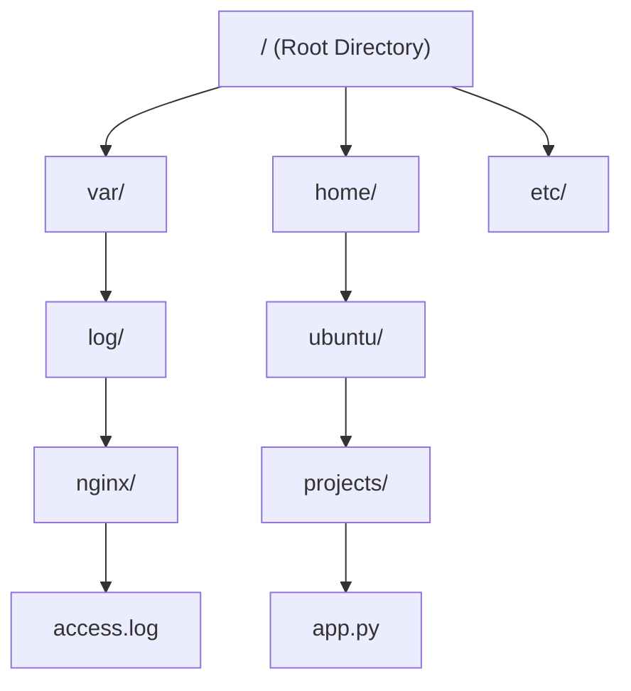

# 09 - Absolute & Relative Paths in Linux

Welcome to the study module on **Absolute and Relative Paths in Linux**.

---

## 📌 Overview

Path navigation and file location resolution form the foundation of command-line operations, shell scripting, system administration, and automated deployment pipelines. In Linux, every file and directory lives inside a single unified tree starting at Root (`/`).

This module provides a comprehensive breakdown of **Absolute Paths** (full paths starting from `/`), **Relative Paths** (paths relative to the current working directory), special directory shortcuts (`.`, `..`, `~`), **Wildcards & Shell Globbing** (`*`, `?`, `[]`, `{}`), real-world DevOps scenarios, troubleshooting, interview prep, and hands-on terminal exercises.

---

## 🗺️ Architectural Path Resolution Diagram



```text
Working Directory: /home/ubuntu

Absolute Path to access.log:
  /var/log/nginx/access.log  (Starts from Root /)

Relative Path to access.log:
  ../../var/log/nginx/access.log (Navigates up 2 levels then down)

Relative Path to app.py:
  projects/app.py  (Starts from current directory /home/ubuntu)
```

---

## 📚 Module Breakdown

| # | File / Module | Key Focus Areas |
| :---: | :--- | :--- |
| **01** | [`01-Path-Basics-and-Mental-Model.md`](file:///c:/Users/binil/OneDrive/Desktop/cloud-devops-engineering-roadmap/Study_Notes_System/akumen%27s/Linux/09-Absolute-and-Relative-Paths/01-Path-Basics-and-Mental-Model.md) | What is a path? The inverted tree model and current working directory (`pwd`) |
| **02** | [`02-Absolute-Paths.md`](file:///c:/Users/binil/OneDrive/Desktop/cloud-devops-engineering-roadmap/Study_Notes_System/akumen%27s/Linux/09-Absolute-and-Relative-Paths/02-Absolute-Paths.md) | Full paths starting at `/`, determinism, system scripts, and cron safety |
| **03** | [`03-Relative-Paths.md`](file:///c:/Users/binil/OneDrive/Desktop/cloud-devops-engineering-roadmap/Study_Notes_System/akumen%27s/Linux/09-Absolute-and-Relative-Paths/03-Relative-Paths.md) | Context-dependent paths, interactive terminal convenience, portable code |
| **04** | [`04-Dot-and-DotDot-Mechanics.md`](file:///c:/Users/binil/OneDrive/Desktop/cloud-devops-engineering-roadmap/Study_Notes_System/akumen%27s/Linux/09-Absolute-and-Relative-Paths/04-Dot-and-DotDot-Mechanics.md) | The current directory (`.`), parent directory (`..`), and home (`~`, `-`) shortcuts |
| **05** | [`05-Absolute-vs-Relative-Comparison.md`](file:///c:/Users/binil/OneDrive/Desktop/cloud-devops-engineering-roadmap/Study_Notes_System/akumen%27s/Linux/09-Absolute-and-Relative-Paths/05-Absolute-vs-Relative-Comparison.md) | Detailed side-by-side comparison matrix and selection guidelines |
| **06** | [`06-Wildcards-and-Shell-Globbing.md`](file:///c:/Users/binil/OneDrive/Desktop/cloud-devops-engineering-roadmap/Study_Notes_System/akumen%27s/Linux/09-Absolute-and-Relative-Paths/06-Wildcards-and-Shell-Globbing.md) | Shell wildcards (`*`, `?`, `[a-z]`, `{1..5}`) and path expansion mechanics |
| **07** | [`07-Practical-Command-Examples.md`](file:///c:/Users/binil/OneDrive/Desktop/cloud-devops-engineering-roadmap/Study_Notes_System/akumen%27s/Linux/09-Absolute-and-Relative-Paths/07-Practical-Command-Examples.md) | Real-world CLI examples with `cd`, `ls`, `cp`, `mv`, `find`, `ln` |
| **08** | [`08-Real-World-Production-Scenarios.md`](file:///c:/Users/binil/OneDrive/Desktop/cloud-devops-engineering-roadmap/Study_Notes_System/akumen%27s/Linux/09-Absolute-and-Relative-Paths/08-Real-World-Production-Scenarios.md) | Production pitfalls: Cron failures, broken symlinks, Docker bind mounts |
| **09** | [`09-Troubleshooting.md`](file:///c:/Users/binil/OneDrive/Desktop/cloud-devops-engineering-roadmap/Study_Notes_System/akumen%27s/Linux/09-Absolute-and-Relative-Paths/09-Troubleshooting.md) | Diagnosing `No such file or directory` & path resolution errors |
| **10** | [`10-Interview-QA.md`](file:///c:/Users/binil/OneDrive/Desktop/cloud-devops-engineering-roadmap/Study_Notes_System/akumen%27s/Linux/09-Absolute-and-Relative-Paths/10-Interview-QA.md) | Technical interview Q&A on path resolution and shell expansion |
| **11** | [`11-Hands-On-Practice.md`](file:///c:/Users/binil/OneDrive/Desktop/cloud-devops-engineering-roadmap/Study_Notes_System/akumen%27s/Linux/09-Absolute-and-Relative-Paths/11-Hands-On-Practice.md) | Practical terminal labs and wildcard challenges |
| **12** | [`12-MCQ.md`](file:///c:/Users/binil/OneDrive/Desktop/cloud-devops-engineering-roadmap/Study_Notes_System/akumen%27s/Linux/09-Absolute-and-Relative-Paths/12-MCQ.md) | Self-assessment multiple-choice quiz |
| **13** | [`13-Quick-Revision.md`](file:///c:/Users/binil/OneDrive/Desktop/cloud-devops-engineering-roadmap/Study_Notes_System/akumen%27s/Linux/09-Absolute-and-Relative-Paths/13-Quick-Revision.md) | 5-minute high-density revision cheat sheet |
| **14** | [`14-Related-Topics.md`](file:///c:/Users/binil/OneDrive/Desktop/cloud-devops-engineering-roadmap/Study_Notes_System/akumen%27s/Linux/09-Absolute-and-Relative-Paths/14-Related-Topics.md) | Next steps in Linux navigation & shell scripting |
| **SOURCE** | [`SOURCE.md`](file:///c:/Users/binil/OneDrive/Desktop/cloud-devops-engineering-roadmap/Study_Notes_System/akumen%27s/Linux/09-Absolute-and-Relative-Paths/SOURCE.md) | Source attribution & educational expansion notes |

---

## 🎯 Learning Objectives

By completing this module, you will understand:
1. The exact mechanism of path resolution starting from Root (`/`) vs Current Working Directory (`pwd`).
2. Why automated system scripts (Cron jobs, Systemd services) must always use Absolute Paths.
3. How special path shortcuts (`.`, `..`, `~`, `-`) function at the filesystem level.
4. How the shell expands wildcards (`*`, `?`, `[0-9]`) before handing arguments to binary executables.
