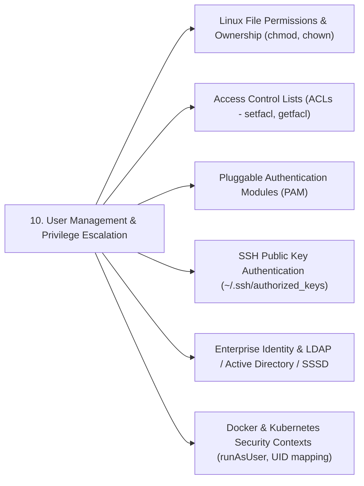

# 15 - Related Topics & Ecosystem Mapping

Understanding User Management in Linux provides the groundwork for essential security, access control, and enterprise identity technologies across the Cloud & DevOps stack.

---

## 🔗 Upstream & Downstream Dependencies

---

## 📚 Ecosystem Map & Recommended Next Topics

1. **Linux File Permissions & Ownership (`chmod`, `chown`, `umask`):**
   * *Relationship:* User and group IDs form the exact basis for standard POSIX permission bit checking (`rwx` for user, group, and others).

2. **Access Control Lists (ACLs - `getfacl`, `setfacl`):**
   * *Relationship:* Standard POSIX permissions limit file ownership to one user and one primary group. ACLs allow granting granular permissions to multiple individual users and groups on a single file or folder.

3. **Pluggable Authentication Modules (PAM):**
   * *Relationship:* The underlying C library layer (`/etc/pam.d/`) responsible for authenticating credentials, enforcing password complexity (`pam_pwquality.so`), lockouts on failed attempts (`pam_faillock.so`), and multi-factor authentication.

4. **SSH Authentication & Key Management:**
   * *Relationship:* Managing non-passsword interactive user logins via `~/.ssh/authorized_keys`, SSH certificates, and restricting root SSH login (`PermitRootLogin no` in `/etc/ssh/sshd_config`).

5. **Centralized Identity & Single Sign-On (LDAP / FreeIPA / SSSD / Active Directory):**
   * *Relationship:* Scaling user management across thousands of cloud servers using centralized directory services (SSSD bridging Linux users to Windows Active Directory or LDAP).

6. **Container & Kubernetes Security Contexts:**
   * *Relationship:* Mapping host UIDs/GIDs into container namespaces, enforcing non-root container users (`USER 10001` in Dockerfile), and defining Kubernetes `securityContext: runAsUser: 1000`.
