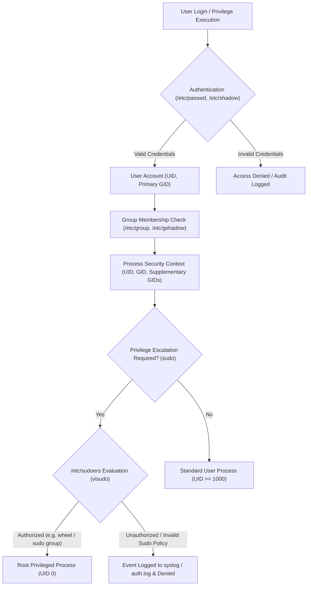

# 10 - User Management in Linux

Welcome to the study module on **User Management in Linux**.

---

## 📌 Overview

User and group management form the backbone of security, privilege control, multi-tenancy, and process isolation in Linux operating systems. Whether managing local users on a standalone server or configuring system service accounts for containers and CI/CD runners in production environments, understanding user management concepts and internals is essential for systems engineering and DevOps.

This module covers **User Management Fundamentals**, **Core Configuration Files** (`/etc/passwd`, `/etc/shadow`, `/etc/group`, `/etc/gshadow`), **User Creation & Modification** (`useradd`, `adduser`, `usermod`, `userdel`), **Password & Account Aging** (`passwd`, `chage`), **Group Administration** (Primary & Supplementary groups), **Privilege Escalation** (`sudo`, `su`, `/etc/sudoers`, `visudo`, `NOPASSWD`, Debian `sudo` group vs RHEL `wheel` group), real-world production setups, troubleshooting, interview questions, hands-on terminal labs, MCQs, and quick revision cheat sheets.

---

## 🗺️ Architectural User Management & Security Flow



```text
User / Group Storage Architecture:
 ┌──────────────────────┬────────────────────────────────────────────────────────┐
 │ File                 │ Purpose & Security Level                               │
 ├──────────────────────┼────────────────────────────────────────────────────────┤
 │ /etc/passwd          │ Account metadata (UID, GID, Home, Shell) - World Readable│
 │ /etc/shadow          │ Hashed Passwords & Password Aging - Root Only (0600)  │
 │ /etc/group           │ Group definitions & supplementary memberships - Readable│
 │ /etc/gshadow         │ Encrypted group passwords & admins - Root Only (0600)   │
 └──────────────────────┴────────────────────────────────────────────────────────┘
```

---

## 📚 Module Breakdown

| # | File / Module | Key Focus Areas |
| :---: | :--- | :--- |
| **01** | [`01-User-Management-Fundamentals.md`](./01-User-Management-Fundamentals.md) | UIDs, GIDs, Root (UID 0), System Accounts (1-999), Normal Users (1000+) |
| **02** | [`02-Core-Configuration-Files.md`](./02-Core-Configuration-Files.md) | Deep breakdown of `/etc/passwd`, `/etc/shadow`, `/etc/group`, `/etc/gshadow` syntax |
| **03** | [`03-User-Creation-and-Management.md`](./03-User-Creation-and-Management.md) | `useradd` vs `adduser`, `/etc/default/useradd`, `/etc/skel`, default shells |
| **04** | [`04-Password-Management-and-Aging.md`](./04-Password-Management-and-Aging.md) | `passwd`, `chage`, shadow password hash algorithms (`$6$`, `$y$`), account locking |
| **05** | [`05-User-Modification-and-Deletion.md`](./05-User-Modification-and-Deletion.md) | `usermod` flags (`-aG`, `-g`, `-d`, `-m`, `-s`, `-l`), safe user deletion with `userdel` |
| **06** | [`06-Group-Management.md`](./06-Group-Management.md) | `groupadd`, `groupmod`, `groupdel`, `gpasswd`, primary vs supplementary groups |
| **07** | [`07-Sudo-Privilege-Escalation-and-Sudoers.md`](./07-Sudo-Privilege-Escalation-and-Sudoers.md) | `sudo`, `su` vs `su -`, `/etc/sudoers`, `visudo`, `NOPASSWD`, Debian `sudo` vs RHEL `wheel` |
| **08** | [`08-Practical-Command-Examples.md`](./08-Practical-Command-Examples.md) | Complete CLI reference table for user, group, and privilege administration |
| **09** | [`09-Real-World-Production-Scenarios.md`](./09-Real-World-Production-Scenarios.md) | DevOps onboarding/offboarding automation, PCI-DSS password policies, service accounts |
| **10** | [`10-Troubleshooting.md`](./10-Troubleshooting.md) | Locked accounts, sudoers syntax errors, broken home permissions, shadow corruption |
| **11** | [`11-Interview-QA.md`](./11-Interview-QA.md) | Junior to Senior level Linux User & Privilege Management interview Q&A |
| **12** | [`12-Hands-On-Lab.md`](./12-Hands-On-Lab.md) | Terminal hands-on labs with practical verification commands |
| **13** | [`13-MCQ.md`](./13-MCQ.md) | Multiple-choice quiz with detailed explanations |
| **14** | [`14-Quick-Revision.md`](./14-Quick-Revision.md) | 5-minute high-density revision cheat sheet |
| **15** | [`15-Related-Topics.md`](./15-Related-Topics.md) | Ecosystem topics: PAM, File Permissions, ACLs, SSH keys, LDAP / Active Directory |
| **SOURCE** | [`SOURCE.md`](./SOURCE.md) | Source attribution & educational material baseline |

---

## 🎯 Learning Objectives

By completing this module, you will understand:
1. How Linux identifies accounts numerically via UIDs and GIDs rather than usernames.
2. The exact colon-separated field structures of `/etc/passwd`, `/etc/shadow`, `/etc/group`, and `/etc/gshadow`.
3. The operational differences between low-level utility `useradd` and high-level interactive script `adduser`.
4. How password aging policy settings in `/etc/shadow` control password expiration, warnings, and account locking.
5. Primary group vs Supplementary group mechanics and how process file creation permissions are affected by effective GIDs.
6. Privilege escalation configuration using `/etc/sudoers`, `visudo`, rule evaluation order, alias definitions, `NOPASSWD`, and distribution differences between Debian/Ubuntu (`sudo` group) and RHEL/Fedora/Rocky (`wheel` group).
