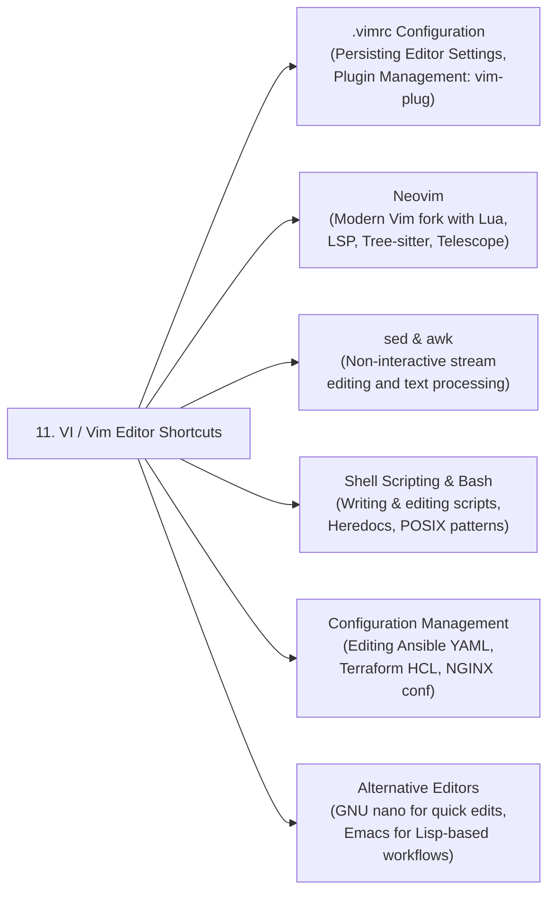

# 15 - Related Topics & Ecosystem Mapping

Mastering VI / Vim provides the foundation for working efficiently across Linux configuration management, scripting, container workflows, and infrastructure automation.

---

## 🔗 Upstream & Downstream Dependencies

---

## 📚 Recommended Next Topics

1. **`.vimrc` Configuration & Plugin Management:**
   * Persist editor preferences (`set expandtab`, `set number`, syntax highlighting) across sessions.
   * Install plugin managers (`vim-plug`, `Vundle`) for productivity enhancements: `NERDTree`, `fzf`, `vim-airline`.

2. **Neovim (Modern VI Successor):**
   * Built on Vim, extended with Lua scripting, built-in LSP (Language Server Protocol) for IDE-like code completion, and Tree-sitter AST syntax highlighting.
   * Widely adopted in modern DevOps and development workflows.

3. **`sed` — Stream Editor:**
   * Non-interactive text processing tool using the same substitution regex syntax as VI (`:s/pattern/replacement/g`).
   * Used in shell pipelines and CI/CD scripts for automated config file patching.

4. **Shell Scripting (Bash / POSIX sh):**
   * VI is the primary editor for writing and maintaining automation scripts, cron jobs, and systemd ExecStart scripts directly on servers.

5. **Ansible YAML Editing Best Practices:**
   * Writing Ansible playbooks in VI with correct YAML indentation settings (`expandtab`, `tabstop=2`, `shiftwidth=2`).

6. **GNU `nano` — Simple Alternative:**
   * Ideal for quick ad-hoc edits in environments where VI expertise is not required. Non-modal with on-screen key bindings displayed at the bottom.

---

| Previous | Index | Next |
| :--- | :---: | ---: |
| [14 - Quick Revision](./14-Quick-Revision.md) | [README](./README.md) | [README (Index)](./README.md) |
