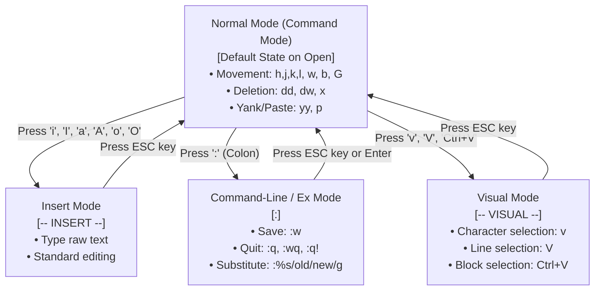

# 11 - VI / Vim Editor Shortcuts

Welcome to the study module on **VI / Vim Editor Shortcuts in Linux**.

---

## 📌 Overview

The **VI (Visual Interface)** editor—and its modern enhanced successor **Vim (Vi IMproved)**—is the ubiquitous text editor present on virtually every Linux distribution, Unix system, container image, and embedded environment. Because server environments and CI/CD runners frequently operate without a Graphical User Interface (GUI), mastering VI navigation, modal editing, search-and-replace, and split-window management is an indispensable core skill for DevOps engineers and Linux system administrators.

This module provides a comprehensive breakdown of **VI Modes (Normal, Insert, Visual, Command-line)**, **Navigation Shortcuts**, **Text Editing & Deletion**, **Yank & Paste (Buffers & Registers)**, **Search & Replace (Regex & Substitution)**, **Save & Quit Operations**, **Multiple File & Window Splits**, **DevOps Configuration Workflows** (YAML indentation, block comments, sudoer edits), **Troubleshooting Swap Files**, **Interview Q&A**, **Hands-On Labs**, **MCQs**, and a **Quick Revision Cheat Sheet**.

---

## 🗺️ Architectural VI State & Mode Diagram



```text
VI Key Mode Transitions Summary:
 ┌─────────────────┬───────────────────────┬────────────────────────────────────────┐
 │ Target Mode     │ Trigger Key           │ Return Key                             │
 ├─────────────────┼───────────────────────┼────────────────────────────────────────┤
 │ Insert Mode     │ i / I / a / A / o / O │ <ESC>                                  │
 │ Command Mode    │ : (Colon)             │ <ESC> or <Enter>                       │
 │ Visual Mode     │ v / V / Ctrl+V        │ <ESC>                                  │
 └─────────────────┴───────────────────────┴────────────────────────────────────────┘
```

---

## 📚 Module Breakdown

| # | File / Module | Key Focus Areas |
| :---: | :--- | :--- |
| **01** | [`01-VI-Editor-Basics-and-Modes.md`](./01-VI-Editor-Basics-and-Modes.md) | What is VI/Vim, modal editing philosophy, Normal, Insert, Visual, Command modes |
| **02** | [`02-Navigation-Shortcuts.md`](./02-Navigation-Shortcuts.md) | Movement (`h,j,k,l`), word jumps (`w,b,e`), line start/end (`0,^,$`), page scroll, line numbers |
| **03** | [`03-Insert-and-Editing-Modes.md`](./03-Insert-and-Editing-Modes.md) | Entry keys (`i,I,a,A,o,O`), character deletion (`x,X`), replacement (`r,R`), change (`cw,cc,C`) |
| **04** | [`04-Delete-Undo-Redo-Operations.md`](./04-Delete-Undo-Redo-Operations.md) | Deletion (`dd,dw,d$,d0,dG`), undo/redo (`u,Ctrl+R`), repeat operation (`.`) |
| **05** | [`05-Yank-Copy-and-Paste.md`](./05-Yank-Copy-and-Paste.md) | Yanking (`yy,yw,y$`), pasting (`p,P`), named registers (`"a-z`), system clipboard (`"+y`) |
| **06** | [`06-Search-and-Replace.md`](./06-Search-and-Replace.md) | Search (`/pattern`, `?pattern`, `n,N`), global substitution (`:%s/old/new/g`, `:%s/old/new/gc`) |
| **07** | [`07-File-Operations-Save-and-Quit.md`](./07-File-Operations-Save-and-Quit.md) | Save & quit (`:w, :q, :wq, :q!, ZZ, ZQ`), file insertion (`:r file`), shell execution (`:!cmd`) |
| **08** | [`08-Multiple-Files-and-Splits.md`](./08-Multiple-Files-and-Splits.md) | Buffers (`:n, :prev, :ls`), window splits (`:sp, :vsp`), split navigation (`Ctrl+W h/j/k/l`) |
| **09** | [`09-Practical-DevOps-Workflows.md`](./09-Practical-DevOps-Workflows.md) | Editing config files, Dockerfiles, YAML indentation (`:set expandtab tabstop=2`), block comments |
| **10** | [`10-Troubleshooting.md`](./10-Troubleshooting.md) | Recovering from swap files (`.swp`), read-only override (`w !sudo tee %`), stuck in insert mode |
| **11** | [`11-Interview-QA.md`](./11-Interview-QA.md) | Technical interview Q&A on VI modal editing, swap file recovery, regex search-and-replace |
| **12** | [`12-Hands-On-Lab.md`](./12-Hands-On-Lab.md) | Step-by-step practical lab exercises with verification commands |
| **13** | [`13-MCQ.md`](./13-MCQ.md) | Multiple-choice quiz with detailed explanations |
| **14** | [`14-Quick-Revision.md`](./14-Quick-Revision.md) | 5-minute high-density revision cheat sheet & keyboard mapping |
| **15** | [`15-Related-Topics.md`](./15-Related-Topics.md) | Ecosystem topics: `.vimrc` configuration, Neovim, Nano/Emacs, sed/awk, shell redirection |
| **SOURCE** | [`SOURCE.md`](./SOURCE.md) | Source attribution & educational material baseline |

---

## 🎯 Learning Objectives

By completing this module, you will understand:
1. The fundamental philosophy of **Modal Editing** and how VI separates navigation commands from text entry.
2. How to navigate files blazingly fast without relying on mouse input or arrow keys.
3. Precise text manipulation using operators (`d`, `y`, `c`) combined with motions (`w`, `$`, `G`).
4. Complex pattern search and global regular expression substitution across single files or multiple buffers.
5. Managing multi-file workflows, buffer switches, and horizontal/vertical window splits.
6. Real-world DevOps automation editing patterns (Visual Block comments, YAML tab-stop formatting, sudoer rescue saves).
