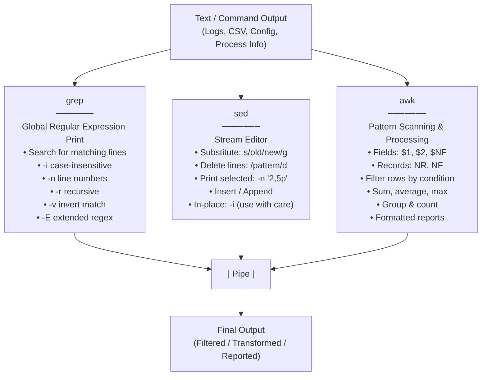

# 12 - grep, sed, and awk — The Text-Processing Trio

Welcome to the study module on **grep, sed, and awk — Linux's three core text-processing tools**.

---

## 📌 Overview

Linux operates in a world of text. Logs, configuration files, CSV data, command output, and process information all flow as streams of text between programs. **grep**, **sed**, and **awk** are the three essential tools every Linux system administrator, SRE, and DevOps engineer must master to search, transform, and analyze this text efficiently — without writing full scripts.

This module provides a comprehensive breakdown of the **Text-Processing Trio** — their individual strengths, common options, regex usage, field processing, substitution, calculations, grouped reports, pipeline chaining, real-world DevOps scenarios, troubleshooting, Interview Q&A, hands-on labs, MCQs, and a Quick Revision cheat sheet.

---

## 🗺️ Tool Mental Model Diagram



```text
Golden Decision Rule:
┌─────────────────────────────────────────────┐
│  Need to FIND something?     →  grep        │
│  Need to CHANGE something?   →  sed         │
│  Need to COMPUTE/FORMAT?     →  awk         │
│  Need all three?             →  pipe them   │
└─────────────────────────────────────────────┘
```

---

## 📚 Module Breakdown

| # | File / Module | Key Focus Areas |
| :---: | :--- | :--- |
| **01** | [`01-Text-Processing-Overview.md`](./01-Text-Processing-Overview.md) | Why text processing matters, tool roles, mental model, pipe mechanics |
| **02** | [`02-Sample-Data.md`](./02-Sample-Data.md) | employees.txt CSV used across all examples, column reference |
| **03** | [`03-grep-Pattern-Searching.md`](./03-grep-Pattern-Searching.md) | Basic search, options (-i, -n, -c, -v, -r, -l), regex, context flags |
| **04** | [`04-sed-Stream-Editor.md`](./04-sed-Stream-Editor.md) | Substitution, in-place editing, delete/print/insert/append operations |
| **05** | [`05-awk-Fields-and-Reports.md`](./05-awk-Fields-and-Reports.md) | Fields, built-in variables, filters, calculations, BEGIN/END, reports |
| **06** | [`06-Combining-Pipelines.md`](./06-Combining-Pipelines.md) | Real pipe chains: grep→awk, sed→grep, awk→sort→uniq |
| **07** | [`07-Real-World-DevOps-Scenarios.md`](./07-Real-World-DevOps-Scenarios.md) | 9 practical DevOps scenarios with explanation of tool choice |
| **08** | [`08-Troubleshooting.md`](./08-Troubleshooting.md) | Common mistakes, debugging strategies, safety rules |
| **09** | [`09-Interview-QA.md`](./09-Interview-QA.md) | 23 technical interview questions with detailed answers |
| **10** | [`10-Hands-On-Lab.md`](./10-Hands-On-Lab.md) | 4-level lab with challenge scenario and documentation task |
| **11** | [`11-MCQs.md`](./11-MCQs.md) | 15 multiple-choice questions with answers |
| **12** | [`12-Quick-Revision.md`](./12-Quick-Revision.md) | 5-minute high-density cheat sheet for all three tools |
| **13** | [`13-Related-Topics.md`](./13-Related-Topics.md) | Ecosystem: sort, uniq, cut, tr, find, jq, Bash scripting, CI/CD |
| **SOURCE** | [`SOURCE.md`](./SOURCE.md) | Source attribution — original material baseline |

---

## 🎯 Learning Objectives

By completing this module, you will understand:
1. How **grep**, **sed**, and **awk** each solve a different primary text-processing problem.
2. How to use **grep** effectively for pattern searching — including regex, context flags, recursive search, and return codes in scripts.
3. How **sed** performs non-interactive stream editing — substitution, deletion, line selection, insertion, and safe in-place editing.
4. How **awk** processes structured text by fields — filtering rows, performing arithmetic, grouping data, and producing formatted reports.
5. How to **chain commands with pipes** to build powerful one-liner data pipelines.
6. Real-world DevOps patterns: log analysis, config transformation, IP extraction, salary reports, traffic summarization.

---

## 💡 Source Foundation

The original source covers all three tools, a sample employee CSV, common commands, regex usage, substitutions, line operations, column processing, calculations, reports, and pipelines. The original material is preserved in [`SOURCE.md`](./SOURCE.md). All other files organize and expand the same material for structured study with clearly labelled learning expansions.
