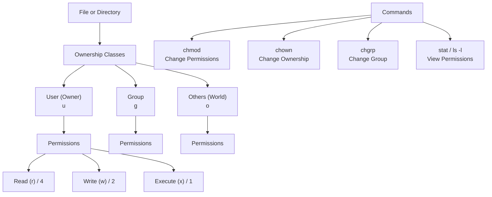

# 13 - Linux File Permissions & Ownership

Welcome to the study module on **Linux File Permissions and Ownership**.

---

## 📌 Overview

Linux is inherently a multi-user operating system. To ensure security, privacy, and system stability, Linux employs a robust permissions model that dictates exactly who can read, write, or execute any file or directory on the system. Mastering this model is non-negotiable for system administrators, DevOps engineers, and developers, as improper permissions are a leading cause of application failures and security breaches.

This module provides a comprehensive breakdown of the Linux permissions model: **read (r), write (w), execute (x)**; the three ownership classes: **User (u), Group (g), Others (o)**; how these differ between **files and directories**; the use of **octal and symbolic notation** with `chmod`; inspecting permissions using `ls`, `stat`, and `namei`; managing ownership with `chown` and `chgrp`; and advanced concepts like the **setuid, setgid, and sticky bit**.

---

## 🗺️ Tool Mental Model Diagram



```text
The Permission Triad:
┌──────────────────────────────────────────────┐
│  Who?     User (u), Group (g), Others (o)    │
│  What?    Read (r), Write (w), Execute (x)   │
│  How?     chmod, chown, chgrp                │
└──────────────────────────────────────────────┘
```

---

## 📚 Module Breakdown

| # | File / Module | Key Focus Areas |
| :---: | :--- | :--- |
| **01** | [`01-Permission-Fundamentals.md`](./01-Permission-Fundamentals.md) | Introduction to the Linux security model and the 9-character permission string. |
| **02** | [`02-Read-Write-Execute-Files-vs-Directories.md`](./02-Read-Write-Execute-Files-vs-Directories.md) | How `rwx` behaves differently for a file versus a directory. |
| **03** | [`03-Ownership-and-Groups.md`](./03-Ownership-and-Groups.md) | The concept of Users (owner), Groups, and Others. |
| **04** | [`04-Inspecting-Permissions-ls-namei-stat.md`](./04-Inspecting-Permissions-ls-namei-stat.md) | Viewing permissions in detail using `ls -l`, `stat`, and tracking paths with `namei`. |
| **05** | [`05-chmod-Symbolic-Notation.md`](./05-chmod-Symbolic-Notation.md) | Using `chmod` with letters and operators (e.g., `u+x`, `g-w`, `o=r`). |
| **06** | [`06-chmod-Octal-Notation.md`](./06-chmod-Octal-Notation.md) | Using `chmod` with numbers (e.g., `755`, `644`, `777`) for speed and automation. |
| **07** | [`07-Special-Permissions-setuid-setgid-sticky-bit.md`](./07-Special-Permissions-setuid-setgid-sticky-bit.md) | Advanced permissions: SUID, SGID, and the Sticky Bit (e.g., `/tmp`). |
| **08** | [`08-Changing-Ownership-chown-chgrp.md`](./08-Changing-Ownership-chown-chgrp.md) | Modifying file owners and groups. |
| **09** | [`09-Real-World-DevOps-Scenarios.md`](./09-Real-World-DevOps-Scenarios.md) | Practical scenarios: web server permissions, SSH keys, shared directories. |
| **10** | [`10-Permission-Troubleshooting.md`](./10-Permission-Troubleshooting.md) | Diagnosing and fixing "Permission denied" errors. |
| **11** | [`11-Interview-QA.md`](./11-Interview-QA.md) | Common interview questions on permissions and ownership. |
| **12** | [`12-Hands-On-Terminal-Practice.md`](./12-Hands-On-Terminal-Practice.md) | Practical labs to apply your knowledge in a safe environment. |
| **13** | [`13-MCQs.md`](./13-MCQ.md) | Multiple-choice questions to test your understanding. |
| **14** | [`14-Quick-Revision.md`](./14-Quick-Revision.md) | 5-minute high-density cheat sheet. |
| **15** | [`15-Related-Topics.md`](./15-Related-Topics.md) | ACLs, SELinux, umask, and extended attributes. |
| **SOURCE** | [`SOURCE.md`](./SOURCE.md) | Source attribution based on provided material. |

---

## 🎯 Learning Objectives

By completing this module, you will understand:
1. How to read and interpret the `ls -l` output to determine file ownership and permissions.
2. The critical differences in how Read, Write, and Execute apply to files vs. directories.
3. How to modify permissions confidently using both symbolic (`chmod u+x`) and octal (`chmod 755`) notations.
4. When and how to change file ownership using `chown` and `chgrp`.
5. The security implications of Special Permissions (SUID, SGID, Sticky Bit) and how to apply them.
6. How to troubleshoot common "Permission denied" errors in real-world DevOps environments.
