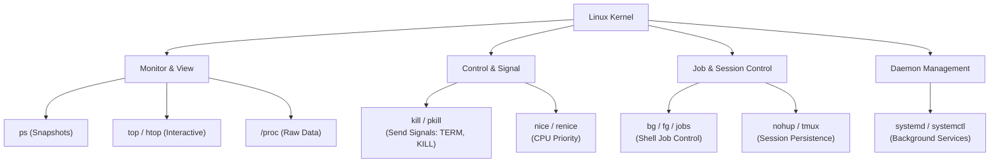

# 14 - Process Management in Linux

Welcome to the study module on **Process Management in Linux**.

---

## 📌 Overview

A Linux system is a dynamic environment where hundreds or thousands of processes run concurrently. A "process" is simply a program in execution. For system administrators, SREs, and DevOps engineers, mastering process management is essential. When a server spikes to 100% CPU, runs out of memory, or an application becomes unresponsive, your ability to quickly identify, monitor, and control the offending processes is what separates novices from experts.

This module provides a comprehensive breakdown of Linux process management: understanding **PIDs, PPIDs, and process states**; viewing processes with `ps`, `top`, and `htop`; sending **signals** with `kill` and `pkill`; managing **foreground and background jobs**; ensuring processes survive terminal disconnects with `nohup` and `tmux`; adjusting priority with `nice`; monitoring system resources; inspecting the `/proc` filesystem; and managing daemons with `systemd`.

---

## 🗺️ Tool Mental Model Diagram



```text
The Process Lifecycle:
┌─────────────────────────────────────────────────────────┐
│  Start  →  Run (R)  →  Sleep (S)  →  Stop (T)  →  Die │
│                        (Wait for I/O) (SIGSTOP) (SIGKILL)│
└─────────────────────────────────────────────────────────┘
```

---

## 📚 Module Breakdown

| # | File / Module | Key Focus Areas |
| :---: | :--- | :--- |
| **01** | [`01-Process-Fundamentals.md`](./01-Process-Fundamentals.md) | What is a process? PID, PPID, UID, and the process tree. |
| **02** | [`02-Process-States.md`](./02-Process-States.md) | Understanding Running (R), Sleeping (S, D), Stopped (T), and Zombie (Z) states. |
| **03** | [`03-Viewing-Processes-ps-top-htop.md`](./03-Viewing-Processes-ps-top-htop.md) | Taking snapshots with `ps` and interactive monitoring with `top`/`htop`. |
| **04** | [`04-Signals-and-Killing-Processes.md`](./04-Signals-and-Killing-Processes.md) | Communicating with processes using `SIGTERM` (15), `SIGKILL` (9), and `SIGHUP` (1). |
| **05** | [`05-Job-Control-fg-bg-jobs.md`](./05-Job-Control-fg-bg-jobs.md) | Managing foreground and background jobs in a shell session. |
| **06** | [`06-Detaching-Processes-nohup-tmux.md`](./06-Detaching-Processes-nohup-tmux.md) | Keeping processes running after you log out (SIGHUP immunity). |
| **07** | [`07-Process-Priority-nice-renice.md`](./07-Process-Priority-nice-renice.md) | Adjusting CPU scheduling priority (niceness). |
| **08** | [`08-Resource-Monitoring.md`](./08-Resource-Monitoring.md) | Monitoring CPU, Memory (`free`), Disk I/O (`iostat`), and open files (`lsof`). |
| **09** | [`09-The-proc-Filesystem.md`](./09-The-proc-Filesystem.md) | Inspecting the kernel's virtual filesystem for deep process insights. |
| **10** | [`10-systemd-and-Service-Management.md`](./10-systemd-and-Service-Management.md) | Managing long-running background services (daemons). |
| **11** | [`11-Job-Scheduling-cron-at.md`](./11-Job-Scheduling-cron-at.md) | Automating process execution at specific times. |
| **12** | [`12-Real-World-DevOps-Scenarios.md`](./12-Real-World-DevOps-Scenarios.md) | Practical scenarios: identifying memory leaks, tracing high CPU. |
| **13** | [`13-Troubleshooting-Checklists.md`](./13-Troubleshooting-Checklists.md) | Step-by-step guides for common process issues. |
| **14** | [`14-Interview-QA.md`](./14-Interview-QA.md) | Common interview questions on process management. |
| **15** | [`15-Hands-On-Terminal-Practice.md`](./15-Hands-On-Terminal-Practice.md) | Practical labs to apply your knowledge in a safe environment. |
| **16** | [`16-MCQs.md`](./16-MCQs.md) | Multiple-choice questions to test your understanding. |
| **17** | [`17-Quick-Revision.md`](./17-Quick-Revision.md) | 5-minute high-density cheat sheet. |
| **18** | [`18-Related-Topics.md`](./18-Related-Topics.md) | Namespaces, cgroups, strace, and process isolation. |
| **SOURCE** | [`SOURCE.md`](./SOURCE.md) | Source attribution based on provided material. |

---

## 🎯 Learning Objectives

By completing this module, you will understand:
1. The fundamental anatomy of a Linux process and its lifecycle.
2. How to use `ps`, `top`, and `htop` to identify resource-hogging applications.
3. The correct and safe ways to terminate processes using various signals (`kill`, `pkill`, `killall`).
4. How to manage shell jobs (`bg`, `fg`, `Ctrl+Z`) and detach them safely (`nohup`, `tmux`).
5. How to adjust process priority (`nice`) to prevent CPU starvation.
6. How to monitor overall system health (Load Average, Memory, I/O) and investigate processes deeply via `/proc`.
