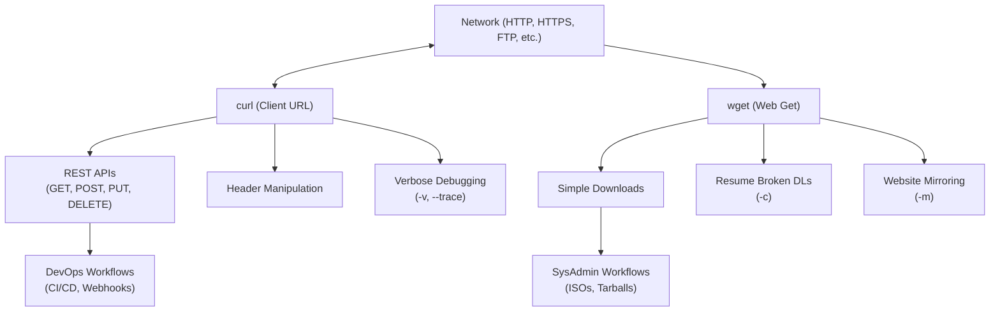

# 15 - wget vs curl

Welcome to the study module on **`wget` vs `curl`**.

---

## 📌 Overview

In the world of Linux and DevOps, interacting with networks via the command line is a daily necessity. Whether you are downloading a software package, testing a REST API, mirroring a website, or triggering a CI/CD pipeline, you will reach for either `wget` or `curl`.

While both tools transfer data across networks, they have fundamentally different design philosophies. `wget` is a robust, autonomous **downloader** designed to fetch files and crawl directories without human intervention. `curl` is a versatile **communication tool** designed to speak dozens of protocols, manipulate headers, and interact dynamically with APIs.

This module provides a comprehensive breakdown of both tools, when to use which, and how to master their syntax for modern DevOps workflows.

---

## 🗺️ Tool Mental Model Diagram



```text
Rule of Thumb:
┌─────────────────────────────────────────────────────────┐
│ If you want to DOWNLOAD a file or mirror a site  → wget │
│ If you want to INTERACT with an API or endpoint  → curl │
└─────────────────────────────────────────────────────────┘
```

---

## 📚 Module Breakdown

| # | File / Module | Key Focus Areas |
| :---: | :--- | :--- |
| **01** | [`01-wget-vs-curl-Fundamentals.md`](./01-wget-vs-curl-Fundamentals.md) | Core differences, history, and supported protocols. |
| **02** | [`02-When-to-use-each.md`](./02-When-to-use-each.md) | Decision matrix: `wget` vs `curl`. |
| **03** | [`03-File-Downloads-and-Filenames.md`](./03-File-Downloads-and-Filenames.md) | Basic downloading and output management (`-O`, `-o`). |
| **04** | [`04-Redirects-and-Resumes.md`](./04-Redirects-and-Resumes.md) | Handling 301/302 redirects (`-L`) and broken downloads (`-c`). |
| **05** | [`05-curl-REST-API-Requests.md`](./05-curl-REST-API-Requests.md) | Using `curl` for GET, POST, PUT, DELETE with JSON payloads. |
| **06** | [`06-Headers-and-Debugging.md`](./06-Headers-and-Debugging.md) | Setting custom headers (`-H`) and viewing request/response details (`-v`, `-i`). |
| **07** | [`07-Authentication.md`](./07-Authentication.md) | Basic Auth (`-u`) and Bearer Tokens. |
| **08** | [`08-File-Uploads.md`](./08-File-Uploads.md) | Uploading files using `curl` (`-F`, `-T`). |
| **09** | [`09-Website-Mirroring-wget.md`](./09-Website-Mirroring-wget.md) | Using `wget` to download entire directories or websites. |
| **10** | [`10-Common-Flags-Cheat-Sheet.md`](./10-Common-Flags-Cheat-Sheet.md) | Quick reference for the most important flags. |
| **11** | [`11-DevOps-CI-CD-Scenarios.md`](./11-DevOps-CI-CD-Scenarios.md) | Real-world usage in scripts, pipelines, and health checks. |
| **12** | [`12-Troubleshooting.md`](./12-Troubleshooting.md) | SSL errors, timeouts, and parsing issues. |
| **13** | [`13-Interview-QA.md`](./13-Interview-QA.md) | Common interview questions on command-line networking. |
| **14** | [`14-Hands-On-Terminal-Practice.md`](./14-Hands-On-Terminal-Practice.md) | Practical labs to apply your knowledge safely. |
| **15** | [`15-MCQs.md`](./15-MCQs.md) | Multiple-choice questions to test your understanding. |
| **16** | [`16-Quick-Revision.md`](./16-Quick-Revision.md) | 5-minute high-density cheat sheet. |
| **17** | [`17-Related-Topics.md`](./17-Related-Topics.md) | `jq`, `httpie`, `netcat`, and `ping`/`telnet`. |
| **SOURCE** | [`SOURCE.md`](./SOURCE.md) | Source attribution based on provided material. |

---

## 🎯 Learning Objectives

By completing this module, you will understand:
1. The architectural and philosophical differences between `wget` and `curl`.
2. How to reliably download large files, handle redirects, and resume broken connections.
3. How to use `curl` as a full-featured HTTP client for interacting with REST APIs.
4. How to pass authentication headers, JSON payloads, and form data.
5. How to use `wget` to recursively download directories or mirror websites.
6. How to troubleshoot SSL/TLS issues and debug network responses using verbose modes.
