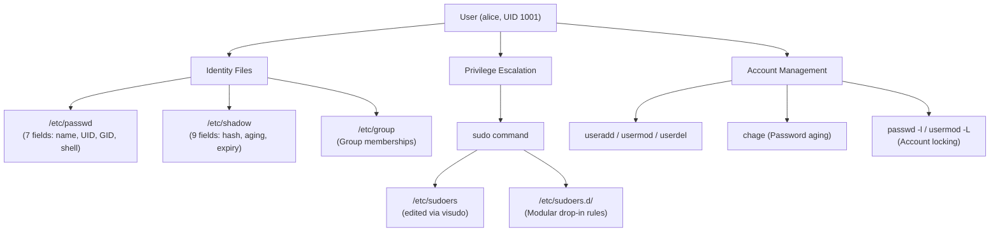

# 16 - Linux User Management & Privilege Escalation

Welcome to the study module on **Linux User Management & Privilege Escalation**.

---

## 📌 Overview

Every action on a Linux system is performed by a **user**. The kernel does not see "Alice" or "Bob"; it sees **UIDs** (User IDs). The entire security model — file access, process ownership, network binds — revolves around mapping human identities to numeric UIDs and controlling what those UIDs are allowed to do.

For DevOps engineers and system administrators, understanding user management means knowing the anatomy of `/etc/passwd` and `/etc/shadow`, creating and managing user accounts, and — critically — controlling **privilege escalation** through `sudo` and the `/etc/sudoers` file. Misconfigured `sudo` rules are one of the most common attack vectors in Linux security.

This module covers the complete lifecycle: creating users, understanding their identity files, granting controlled root access via `sudo`, auditing privilege, and hardening the system against escalation attacks.

---

## 🗺️ Architecture Diagram

---

## 📚 Module Breakdown

| # | File / Module | Key Focus Areas |
| :---: | :--- | :--- |
| **01** | [`01-Users-Groups-UID-GID.md`](./01-Users-Groups-UID-GID.md) | What is a user? UIDs, GIDs, primary vs. secondary groups. |
| **02** | [`02-etc-passwd-Deep-Dive.md`](./02-etc-passwd-Deep-Dive.md) | All 7 fields of `/etc/passwd` explained. |
| **03** | [`03-etc-shadow-Deep-Dive.md`](./03-etc-shadow-Deep-Dive.md) | All 9 fields of `/etc/shadow`, hash formats, password aging. |
| **04** | [`04-Creating-Managing-Users.md`](./04-Creating-Managing-Users.md) | `useradd`, `usermod`, `userdel`, `groupadd`. |
| **05** | [`05-sudo-Fundamentals.md`](./05-sudo-Fundamentals.md) | How `sudo` works, `sudo -l`, `sudo -i`, `sudo -s`, `sudo -u`. |
| **06** | [`06-etc-sudoers-and-visudo.md`](./06-etc-sudoers-and-visudo.md) | Editing `/etc/sudoers` safely with `visudo`, syntax rules. |
| **07** | [`07-sudoers-d-Modular-Rules.md`](./07-sudoers-d-Modular-Rules.md) | Drop-in files under `/etc/sudoers.d/` for clean management. |
| **08** | [`08-NOPASSWD-and-Least-Privilege.md`](./08-NOPASSWD-and-Least-Privilege.md) | Passwordless sudo and designing minimal-privilege rules. |
| **09** | [`09-Password-Management-and-Aging.md`](./09-Password-Management-and-Aging.md) | `chage`, account locking/unlocking, `passwd -l`. |
| **10** | [`10-Service-Accounts-and-nologin.md`](./10-Service-Accounts-and-nologin.md) | Non-human accounts, `/sbin/nologin`, UID 0 auditing. |
| **11** | [`11-Privilege-Escalation-Concepts.md`](./11-Privilege-Escalation-Concepts.md) | How attackers escalate, common misconfigurations. |
| **12** | [`12-Security-Auditing.md`](./12-Security-Auditing.md) | Auditing UID 0, SUID binaries, stale accounts. |
| **13** | [`13-Real-World-DevOps-Scenarios.md`](./13-Real-World-DevOps-Scenarios.md) | Onboarding, offboarding, CI/CD service accounts. |
| **14** | [`14-Troubleshooting.md`](./14-Troubleshooting.md) | "User not in sudoers", locked accounts, broken shells. |
| **15** | [`15-Interview-QA.md`](./15-Interview-QA.md) | Common interview questions on users, sudo, and security. |
| **16** | [`16-Hands-On-Terminal-Practice.md`](./16-Hands-On-Terminal-Practice.md) | Practical labs for user creation and sudo configuration. |
| **17** | [`17-MCQs.md`](./17-MCQs.md) | Multiple-choice questions to test your understanding. |
| **18** | [`18-Quick-Revision.md`](./18-Quick-Revision.md) | 5-minute high-density cheat sheet. |
| **19** | [`19-Related-Topics.md`](./19-Related-Topics.md) | PAM, SSH keys, SELinux, LDAP/AD, Cloud IAM. |
| **SOURCE** | [`SOURCE.md`](./SOURCE.md) | Source attribution based on provided material. |

---

## 🎯 Learning Objectives

By completing this module, you will understand:
1. The anatomy of Linux identity files (`/etc/passwd`, `/etc/shadow`, `/etc/group`).
2. How to create, modify, lock, and delete user accounts safely.
3. How `sudo` works and how to write precise, least-privilege sudoers rules.
4. The critical importance of using `visudo` and `/etc/sudoers.d/` for modular configuration.
5. How to audit a system for privilege escalation vulnerabilities (UID 0 accounts, stale SUID binaries).
6. How to design secure service accounts for applications and CI/CD pipelines.
